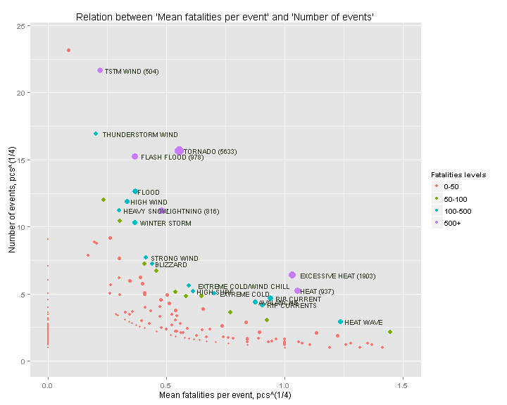
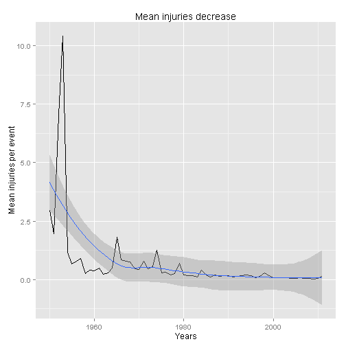

author: *Grigory Miholap*
date: *15/11/2015*

**Note**: deer peers, I sorry for my English. 

## Questions
**1**. Across the United States, which types of events are most harmful with respect to population health?  
**2**. Across the United States, which types of events have the greatest economic consequences?

## Synopsis 
For each types of events we've calculated total fatalities, injuries and damage, and 
mean fatalities, injuries and damage too. (we used whole period of observations 1950-2011). 
Such types of events how "TORNADO", "FLASH FLOOD", "FLOOD" and "HIGH WIND" are in 
both tables "TOP-10 total fatalities"" and "TOP-10 total damage".
So, we can say, that they are the most injurious types of events. In addition we've 
discovered interesting association  between mean fatalities per event and number
of events. (because we are investigating fix period, we can say about frequency 
of event instead number of event). I would note, that there are types of events,
which occur more seldom, than for example tornados or floods, but they are much
more harmful (for example EXTREME HEAT).

## Data Processing
1. I've downloaded data by URL [Storm Data](https://d396qusza40orc.cloudfront.net/repdata%2Fdata%2FStormData.csv.bz2)

2. I've read bz2-file

```r
df <- read.csv(bzfile("./repdata-data-StormData.csv.bz2"))
```

See first 3 transposed rows 

```r
t(head(df, n = 3))
```

```
##            1                   2                   3                  
## STATE__    "1"                 "1"                 "1"                
## BGN_DATE   "4/18/1950 0:00:00" "4/18/1950 0:00:00" "2/20/1951 0:00:00"
## BGN_TIME   "0130"              "0145"              "1600"             
## TIME_ZONE  "CST"               "CST"               "CST"              
## COUNTY     "97"                " 3"                "57"               
## COUNTYNAME "MOBILE"            "BALDWIN"           "FAYETTE"          
## STATE      "AL"                "AL"                "AL"               
## EVTYPE     "TORNADO"           "TORNADO"           "TORNADO"          
## BGN_RANGE  "0"                 "0"                 "0"                
## BGN_AZI    ""                  ""                  ""                 
## BGN_LOCATI ""                  ""                  ""                 
## END_DATE   ""                  ""                  ""                 
## END_TIME   ""                  ""                  ""                 
## COUNTY_END "0"                 "0"                 "0"                
## COUNTYENDN NA                  NA                  NA                 
## END_RANGE  "0"                 "0"                 "0"                
## END_AZI    ""                  ""                  ""                 
## END_LOCATI ""                  ""                  ""                 
## LENGTH     "14.0"              " 2.0"              " 0.1"             
## WIDTH      "100"               "150"               "123"              
## F          "3"                 "2"                 "2"                
## MAG        "0"                 "0"                 "0"                
## FATALITIES "0"                 "0"                 "0"                
## INJURIES   "15"                " 0"                " 2"               
## PROPDMG    "25.0"              " 2.5"              "25.0"             
## PROPDMGEXP "K"                 "K"                 "K"                
## CROPDMG    "0"                 "0"                 "0"                
## CROPDMGEXP ""                  ""                  ""                 
## WFO        ""                  ""                  ""                 
## STATEOFFIC ""                  ""                  ""                 
## ZONENAMES  ""                  ""                  ""                 
## LATITUDE   "3040"              "3042"              "3340"             
## LONGITUDE  "8812"              "8755"              "8742"             
## LATITUDE_E "3051"              "   0"              "   0"             
## LONGITUDE_ "8806"              "   0"              "   0"             
## REMARKS    ""                  ""                  ""                 
## REFNUM     "1"                 "2"                 "3"
```

check NAs for `df`

```r
sapply(df, function(e) sum(is.na(e)))
```

```
##    STATE__   BGN_DATE   BGN_TIME  TIME_ZONE     COUNTY COUNTYNAME 
##          0          0          0          0          0          0 
##      STATE     EVTYPE  BGN_RANGE    BGN_AZI BGN_LOCATI   END_DATE 
##          0          0          0          0          0          0 
##   END_TIME COUNTY_END COUNTYENDN  END_RANGE    END_AZI END_LOCATI 
##          0          0     902297          0          0          0 
##     LENGTH      WIDTH          F        MAG FATALITIES   INJURIES 
##          0          0     843563          0          0          0 
##    PROPDMG PROPDMGEXP    CROPDMG CROPDMGEXP        WFO STATEOFFIC 
##          0          0          0          0          0          0 
##  ZONENAMES   LATITUDE  LONGITUDE LATITUDE_E LONGITUDE_    REMARKS 
##          0         47          0         40          0          0 
##     REFNUM 
##          0
```
There isn't NA-values in interesting columns - EVTYPE, FATALITIES, INJURIES, *DMG

**Thus, the data are ready for analysis.**

## Results
In first, I,ve calculated total fatalities and injuries (see variables `FATALtotal` 
and `INJURtotal`), and mean fatalities and injuries (variables `FATALmean` and 
`INJURmean`).

```r
library(dplyr)
tmp <- group_by(df, EVTYPE)
tmp2 <- summarise(.data=tmp, FATALtotal=sum(FATALITIES), FATALmean=mean(FATALITIES),
                  EVTYPEn=n(), INJURtotal=sum(INJURIES), INJURmean=mean(INJURIES))
# order by FATALtotal
tmp2ord <- tmp2[order(tmp2$FATALtotal, decreasing = T),]
```


Here we see TOP-10 types of events by variable `FATALtotal`

```r
library(xtable)
xt <- xtable(head(tmp2ord, n=10))
print(xt, type="html")
```

<!-- html table generated in R 3.2.2 by xtable 1.8-0 package -->
<!-- Tue Nov 24 18:59:58 2015 -->
<table border=1>
<tr> <th>  </th> <th> EVTYPE </th> <th> FATALtotal </th> <th> FATALmean </th> <th> EVTYPEn </th> <th> INJURtotal </th> <th> INJURmean </th>  </tr>
  <tr> <td align="right"> 1 </td> <td> TORNADO </td> <td align="right"> 5633.00 </td> <td align="right"> 0.09 </td> <td align="right"> 60652 </td> <td align="right"> 91346.00 </td> <td align="right"> 1.51 </td> </tr>
  <tr> <td align="right"> 2 </td> <td> EXCESSIVE HEAT </td> <td align="right"> 1903.00 </td> <td align="right"> 1.13 </td> <td align="right"> 1678 </td> <td align="right"> 6525.00 </td> <td align="right"> 3.89 </td> </tr>
  <tr> <td align="right"> 3 </td> <td> FLASH FLOOD </td> <td align="right"> 978.00 </td> <td align="right"> 0.02 </td> <td align="right"> 54277 </td> <td align="right"> 1777.00 </td> <td align="right"> 0.03 </td> </tr>
  <tr> <td align="right"> 4 </td> <td> HEAT </td> <td align="right"> 937.00 </td> <td align="right"> 1.22 </td> <td align="right"> 767 </td> <td align="right"> 2100.00 </td> <td align="right"> 2.74 </td> </tr>
  <tr> <td align="right"> 5 </td> <td> LIGHTNING </td> <td align="right"> 816.00 </td> <td align="right"> 0.05 </td> <td align="right"> 15754 </td> <td align="right"> 5230.00 </td> <td align="right"> 0.33 </td> </tr>
  <tr> <td align="right"> 6 </td> <td> TSTM WIND </td> <td align="right"> 504.00 </td> <td align="right"> 0.00 </td> <td align="right"> 219940 </td> <td align="right"> 6957.00 </td> <td align="right"> 0.03 </td> </tr>
  <tr> <td align="right"> 7 </td> <td> FLOOD </td> <td align="right"> 470.00 </td> <td align="right"> 0.02 </td> <td align="right"> 25326 </td> <td align="right"> 6789.00 </td> <td align="right"> 0.27 </td> </tr>
  <tr> <td align="right"> 8 </td> <td> RIP CURRENT </td> <td align="right"> 368.00 </td> <td align="right"> 0.78 </td> <td align="right"> 470 </td> <td align="right"> 232.00 </td> <td align="right"> 0.49 </td> </tr>
  <tr> <td align="right"> 9 </td> <td> HIGH WIND </td> <td align="right"> 248.00 </td> <td align="right"> 0.01 </td> <td align="right"> 20212 </td> <td align="right"> 1137.00 </td> <td align="right"> 0.06 </td> </tr>
  <tr> <td align="right"> 10 </td> <td> AVALANCHE </td> <td align="right"> 224.00 </td> <td align="right"> 0.58 </td> <td align="right"> 386 </td> <td align="right"> 170.00 </td> <td align="right"> 0.44 </td> </tr>
   </table>

##  
Next, we see TOP-10 types of events by variable  `FATALmean`

```r
library(xtable)
xt <- xtable(head(tmp2[order(tmp2$FATALmean, decreasing = T),], n=10))
print(xt, type="html")
```

<!-- html table generated in R 3.2.2 by xtable 1.8-0 package -->
<!-- Tue Nov 24 18:59:58 2015 -->
<table border=1>
<tr> <th>  </th> <th> EVTYPE </th> <th> FATALtotal </th> <th> FATALmean </th> <th> EVTYPEn </th> <th> INJURtotal </th> <th> INJURmean </th>  </tr>
  <tr> <td align="right"> 1 </td> <td> TORNADOES, TSTM WIND, HAIL </td> <td align="right"> 25.00 </td> <td align="right"> 25.00 </td> <td align="right">   1 </td> <td align="right"> 0.00 </td> <td align="right"> 0.00 </td> </tr>
  <tr> <td align="right"> 2 </td> <td> COLD AND SNOW </td> <td align="right"> 14.00 </td> <td align="right"> 14.00 </td> <td align="right">   1 </td> <td align="right"> 0.00 </td> <td align="right"> 0.00 </td> </tr>
  <tr> <td align="right"> 3 </td> <td> TROPICAL STORM GORDON </td> <td align="right"> 8.00 </td> <td align="right"> 8.00 </td> <td align="right">   1 </td> <td align="right"> 43.00 </td> <td align="right"> 43.00 </td> </tr>
  <tr> <td align="right"> 4 </td> <td> RECORD/EXCESSIVE HEAT </td> <td align="right"> 17.00 </td> <td align="right"> 5.67 </td> <td align="right">   3 </td> <td align="right"> 0.00 </td> <td align="right"> 0.00 </td> </tr>
  <tr> <td align="right"> 5 </td> <td> EXTREME HEAT </td> <td align="right"> 96.00 </td> <td align="right"> 4.36 </td> <td align="right">  22 </td> <td align="right"> 155.00 </td> <td align="right"> 7.05 </td> </tr>
  <tr> <td align="right"> 6 </td> <td> HEAT WAVE DROUGHT </td> <td align="right"> 4.00 </td> <td align="right"> 4.00 </td> <td align="right">   1 </td> <td align="right"> 15.00 </td> <td align="right"> 15.00 </td> </tr>
  <tr> <td align="right"> 7 </td> <td> HIGH WIND/SEAS </td> <td align="right"> 4.00 </td> <td align="right"> 4.00 </td> <td align="right">   1 </td> <td align="right"> 0.00 </td> <td align="right"> 0.00 </td> </tr>
  <tr> <td align="right"> 8 </td> <td> MARINE MISHAP </td> <td align="right"> 7.00 </td> <td align="right"> 3.50 </td> <td align="right">   2 </td> <td align="right"> 5.00 </td> <td align="right"> 2.50 </td> </tr>
  <tr> <td align="right"> 9 </td> <td> WINTER STORMS </td> <td align="right"> 10.00 </td> <td align="right"> 3.33 </td> <td align="right">   3 </td> <td align="right"> 17.00 </td> <td align="right"> 5.67 </td> </tr>
  <tr> <td align="right"> 10 </td> <td> Heavy surf and wind </td> <td align="right"> 3.00 </td> <td align="right"> 3.00 </td> <td align="right">   1 </td> <td align="right"> 0.00 </td> <td align="right"> 0.00 </td> </tr>
   </table>


##  
Next, I've created new factor `FATALtotalFac` for `FATALtotal` (It's necessary for plot)

```r
tmp2ord$FATALtotalFac <- character(length = nrow(tmp2ord))
tmp2ord[tmp2ord$FATALtotal>=500,]$FATALtotalFac<-"500+" 
tmp2ord[tmp2ord$FATALtotal>=100 & tmp2ord$FATALtotal<500,]$FATALtotalFac<-"100-500" 
tmp2ord[tmp2ord$FATALtotal>=50 & tmp2ord$FATALtotal<100,]$FATALtotalFac<-"50-100" 
tmp2ord[tmp2ord$FATALtotal<50,]$FATALtotalFac<-"0-50" 
tmp2ord$FATALtotalFac <- factor(x=tmp2ord$FATALtotalFac,levels = c("0-50", "50-100",
                                                                   "100-500", "500+"),
                                ordered = T)
```
 

some transformations for adding labels on plot

```r
tmp3 <- tmp2ord[tmp2ord$FATALtotalFac!="0-50" & tmp2ord$FATALtotalFac!="50-100",]
tmp3$EVTYPE <- as.character(tmp3$EVTYPE)
tmp3[tmp3$FATALtotalFac=="500+",]$EVTYPE <- paste0(tmp3[tmp3$FATALtotalFac=="500+",]$EVTYPE," (", tmp3[tmp3$FATALtotalFac=="500+",]$FATALtotal, ")")
```

Next, I've made informative plot, which describe association  between mean fatalities 
per event and number of events. 

```r
library(ggplot2)

ggplot(data = tmp2ord, aes(x=(FATALmean)^(1/4), y=(EVTYPEn)^(1/4), col=FATALtotalFac, size=(FATALtotal)^(1/4))) + 
    geom_point()+xlim(0,1.5)+
    ylim(0,24)+
    annotate("text", label = tmp3$EVTYPE, x = (tmp3$FATALmean)^(1/4), y = (tmp3$EVTYPEn)^(1/4), size = 3, colour = "#2e3a23",  hjust=-0.1)+
    xlab("Mean fatalities per event, pcs^(1/4)")+
    ylab("Number of events, pcs^(1/4)")+
    labs(title="Relation between 'Mean fatalities per event' and 'Number of events'")+
    scale_size_continuous(breaks=NULL)+
    scale_color_discrete(name="Fatalities levels")
```

 
We can see negative association between mean fatalities per event and number
of events (or frequency of event). All evets from TOP-10
are lying near centre of the plot.

**It's interesting**: there is positive correlation between FATALtotal and INJURtotal

```r
fit <- lm(FATALtotal~INJURtotal, data = tmp2ord)
summary(fit)
```

```
## 
## Call:
## lm(formula = FATALtotal ~ INJURtotal, data = tmp2ord)
## 
## Residuals:
##    Min     1Q Median     3Q    Max 
## -181.2   -6.3   -6.3   -6.3 1481.8 
## 
## Coefficients:
##              Estimate Std. Error t value Pr(>|t|)    
## (Intercept) 6.3045903  2.0897235   3.017  0.00262 ** 
## INJURtotal  0.0635815  0.0007099  89.558  < 2e-16 ***
## ---
## Signif. codes:  0 '***' 0.001 '**' 0.01 '*' 0.05 '.' 0.1 ' ' 1
## 
## Residual standard error: 65.51 on 983 degrees of freedom
## Multiple R-squared:  0.8908,	Adjusted R-squared:  0.8907 
## F-statistic:  8021 on 1 and 983 DF,  p-value: < 2.2e-16
```
There is strong correlation between FATALtotal and INJURtotal.
If INJURtotal increased on 100 men then FATALtotal increased on 6 men.


##  
Mean injuries in time series

```r
# preparation data for plot
df$BGN_DATE <- as.Date(df$BGN_DATE, "%m/%d/%Y")
library(lubridate)
df$year <- year(df$BGN_DATE)
tmp <- group_by(df, year)
tmp2 <- summarise(.data=tmp, INJURtotal=sum(INJURIES), INJURmean=mean(INJURIES))
#make plot
ggplot(data = tmp2, aes(x=year, y=INJURmean))+geom_line()+geom_smooth()+
    ylab("Mean injuries per event")+
    xlab("Years")+
    labs(title="Mean injuries decrease")
```

 
We see, that mean injuries decrease.

Next, I've made table TOP-10 total damage

```r
df$PROPDMGdoll <- df$PROPDMG
df[df$PROPDMGEXP=="K" | df$PROPDMGEXP=="k",]$PROPDMGdoll <- df[df$PROPDMGEXP=="K" | df$PROPDMGEXP=="k",]$PROPDMG*10^3
df[df$PROPDMGEXP=="M" | df$PROPDMGEXP=="m",]$PROPDMGdoll <- df[df$PROPDMGEXP=="M" | df$PROPDMGEXP=="m",]$PROPDMG*10^6
df[df$PROPDMGEXP=="B" | df$PROPDMGEXP=="b",]$PROPDMGdoll <- df[df$PROPDMGEXP=="B" | df$PROPDMGEXP=="b",]$PROPDMG*10^9
```


```r
tmp <- group_by(df, EVTYPE)
tmp3 <- summarise(.data=tmp, PROPDMGtotal=sum(PROPDMGdoll), PROPDMGmean=mean(PROPDMGdoll),
                  FATALtotal=sum(FATALITIES))
# order by PROPDMGtotal
tmp3ord <- tmp3[order(tmp3$PROPDMGtotal, decreasing = T),]
```

Here we see TOP-10 types of events by variable `PROPDMGtotal`

```r
xt <- xtable(head(tmp3ord, n=10))
print(xt, type="html")
```

<!-- html table generated in R 3.2.2 by xtable 1.8-0 package -->
<!-- Tue Nov 24 19:00:06 2015 -->
<table border=1>
<tr> <th>  </th> <th> EVTYPE </th> <th> PROPDMGtotal </th> <th> PROPDMGmean </th> <th> FATALtotal </th>  </tr>
  <tr> <td align="right"> 1 </td> <td> FLOOD </td> <td align="right"> 144657709807.00 </td> <td align="right"> 5711826.18 </td> <td align="right"> 470.00 </td> </tr>
  <tr> <td align="right"> 2 </td> <td> HURRICANE/TYPHOON </td> <td align="right"> 69305840000.00 </td> <td align="right"> 787566363.64 </td> <td align="right"> 64.00 </td> </tr>
  <tr> <td align="right"> 3 </td> <td> TORNADO </td> <td align="right"> 56937160778.70 </td> <td align="right"> 938751.58 </td> <td align="right"> 5633.00 </td> </tr>
  <tr> <td align="right"> 4 </td> <td> STORM SURGE </td> <td align="right"> 43323536000.00 </td> <td align="right"> 165990559.39 </td> <td align="right"> 13.00 </td> </tr>
  <tr> <td align="right"> 5 </td> <td> FLASH FLOOD </td> <td align="right"> 16140812067.10 </td> <td align="right"> 297378.49 </td> <td align="right"> 978.00 </td> </tr>
  <tr> <td align="right"> 6 </td> <td> HAIL </td> <td align="right"> 15732267047.70 </td> <td align="right"> 54500.84 </td> <td align="right"> 15.00 </td> </tr>
  <tr> <td align="right"> 7 </td> <td> HURRICANE </td> <td align="right"> 11868319010.00 </td> <td align="right"> 68208729.94 </td> <td align="right"> 61.00 </td> </tr>
  <tr> <td align="right"> 8 </td> <td> TROPICAL STORM </td> <td align="right"> 7703890550.00 </td> <td align="right"> 11165058.77 </td> <td align="right"> 58.00 </td> </tr>
  <tr> <td align="right"> 9 </td> <td> WINTER STORM </td> <td align="right"> 6688497251.00 </td> <td align="right"> 585016.82 </td> <td align="right"> 206.00 </td> </tr>
  <tr> <td align="right"> 10 </td> <td> HIGH WIND </td> <td align="right"> 5270046295.00 </td> <td align="right"> 260738.49 </td> <td align="right"> 248.00 </td> </tr>
   </table>

##  
Intersection TOP-10 total fatalities and TOP-10 total damage

```r
intersect(tmp2ord$EVTYPE[1:10], tmp3ord$EVTYPE[1:10])
```

```
## [1] "TORNADO"     "FLASH FLOOD" "FLOOD"       "HIGH WIND"
```
So, such types of events how "TORNADO", "FLASH FLOOD", "FLOOD" and "HIGH WIND" are in 
TOP-10 total fatalities and TOP-10 total damage simultaneously. We can say, that 
they are the most injurious types of events.

