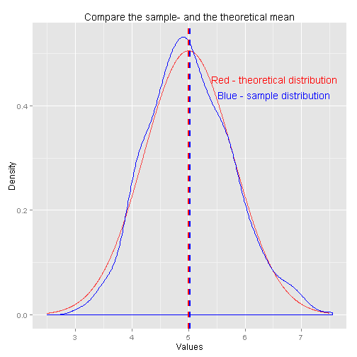
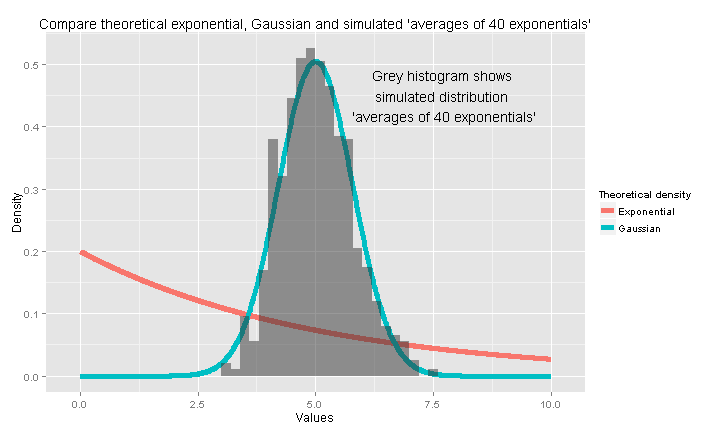

## How works the Central Limit Theorem: investigation 'averages of 40 exponentials' distribution and compare it with the Gaussian

author: *Grigory Miholap*  
date: *20/11/2015*

## Overview
In this report we've verified how works Central Limit Theorem. We've simulated 
the distribution of 1000 'averages of 40 exponentials' and compared it with
Gaussian.

## Simulations
Function `set.seed` is necessary for reproducibility

```r
set.seed(50000)
```

We simulate 1000 samples. Each sample contains 40 random values generated using 
function rexp. Then we calculate mean each sample and get new 1000-sample 
'averages of 40 exponentials' 

```r
lambda <- 0.2
sample_s <- 40 # size of sample
sample_n <- 1000 # number of samples
distaverages <- numeric(length = sample_n) # it's variable the distribution of averages of 40 exponentials.
for (i in 1:sample_n) {
    distaverages[i] <- mean(rexp(sample_s, lambda))   
}
```

## Sample Mean vs Theoretical Mean
1. I've shown the sample mean and compared it to the theoretical mean of the distribution.


```r
sample_mean <- mean(distaverages)
theor_mean <- 1/lambda
```
variable  | value
------------- | -------------
sample mean  | 5.0272521
theoretical mean  | 5
difference (%)  | -0.54

We see in this case, that the sample mean is very close approximation of 
the theoretical mean. Therefore the plot below is not very informative.  


```r
library(ggplot2)
xvals <- seq(2.5, 7.5, length = 1000)
d <- data.frame(dnorm=dnorm(xvals, mean = theor_mean, sd = 1/lambda/sqrt(sample_s)),distaverages=distaverages)
ggplot(d, aes(x = xvals, y = dnorm))+geom_line(color="red", alpha=0.7)+
geom_density(aes(x=distaverages, y = ..density..), color="blue", alpha=0.5)+
    xlab("Values")+
    ylab("Density")+
    labs(title="Compare the sample- and the theoretical mean")+
    geom_vline(aes(xintercept = theor_mean), show_guide = TRUE, size = 1, linetype="dashed", color="red")+
    geom_vline(aes(xintercept = sample_mean), show_guide = TRUE, size = 1, linetype="dashed", color="blue")+
    annotate("text", label = "Red - theoretical distribution", x=6.52, y=0.45, col="red")+
    annotate("text", label = "Blue - sample distribution", x=6.52, y=0.42, col="blue")
```

 


## Sample Variance vs Theoretical Variance
2. I've shown the sample variance and compared it to the theoretical variance of the distribution.

```r
sample_variance <- sd(distaverages)
theor_variance <- 1/lambda/sqrt(sample_s)
```
variable  | value
------------- | -------------
sample variance  | 0.7593705
theoretical variance  | 0.7905694
difference (%)  | 4.11

We can see, that difference is small, so I think it's good approximation.

## Distribution
3. I show that the distribution is approximately normal.
Via figures and text, explain how one can tell the distribution is approximately normal.


```r
xvals <- seq(0, 10, length = 1000)
d <- data.frame(distr=c(dexp(xvals,lambda), dnorm=dnorm(xvals, mean = theor_mean, sd = theor_variance)),
                Distribution=rep(c("Exponential","Gaussian "),each=1000))
ggplot(d, aes(x = c(xvals,xvals), y = distr))+geom_line(size = 2, aes(colour = Distribution))+
geom_histogram(aes(x=distaverages, y = ..density..), binwidth = 0.2, alpha=0.5)+
    xlab("Values")+
    ylab("Density")+
    labs(title="Compare theoretical exponential, Gaussian and simulated 'averages of 40 exponentials'")+
    annotate("text", label = "Grey histogram shows\n simulated distribution \n 'averages of 40 exponentials'", x=7.7, y=0.45)+
    scale_color_discrete(name="Theoretical density")
```

 
 So, on the plot wee can see, that density of the exponential distribution (red line) and
 density of Gaussian (blue line) are very different. But if we compare Gaussian and
 sample 'averages of 40 exponentials' (grey histogram on the plot), we can say, that 
 our simulated sample 'averages of 40 exponentials' is approximately normal.
 **The Central Limit Theorem works!**
