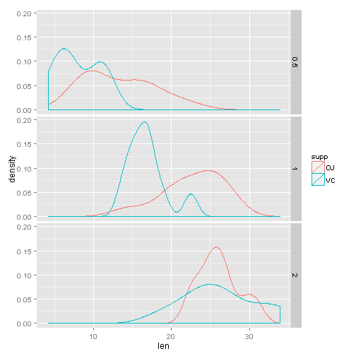
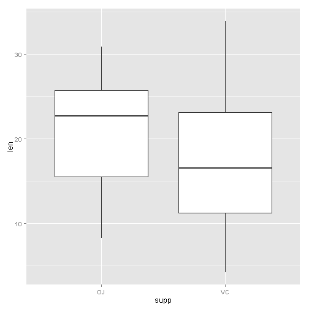
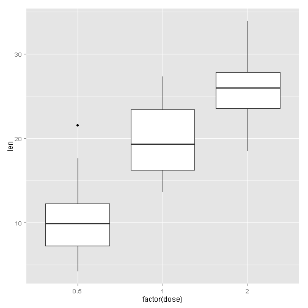

## Compare tooth growth by supp and dose

author: *Grigory Miholap*  
date: *20/11/2015*

##1. Overview
In report I've compared tooth growth by supp and dose. Using Student's test,
I've shown, that difference of mean between groups supp:OJ and supp:VS has low level of 
significance, but difference of mean between all pairs (dose:0.5-dose:1),
(dose:1-dose:2) has high level of significance

##2. Loading and preprocessing the data
So, we're going to analyze the ToothGrowth data in the R datasets package

```r
data(ToothGrowth)
```

See first 10 rows

```r
head(ToothGrowth, n=10)
```

```
##     len supp dose
## 1   4.2   VC  0.5
## 2  11.5   VC  0.5
## 3   7.3   VC  0.5
## 4   5.8   VC  0.5
## 5   6.4   VC  0.5
## 6  10.0   VC  0.5
## 7  11.2   VC  0.5
## 8  11.2   VC  0.5
## 9   5.2   VC  0.5
## 10  7.0   VC  0.5
```

There aren't NAs. It's well.

```r
sapply(ToothGrowth, function(e) sum(is.na(e)))
```

```
##  len supp dose 
##    0    0    0
```

summary by column

```r
summary(ToothGrowth)
```

```
##       len        supp         dose      
##  Min.   : 4.20   OJ:30   Min.   :0.500  
##  1st Qu.:13.07   VC:30   1st Qu.:0.500  
##  Median :19.25           Median :1.000  
##  Mean   :18.81           Mean   :1.167  
##  3rd Qu.:25.27           3rd Qu.:2.000  
##  Max.   :33.90           Max.   :2.000
```

```r
str(ToothGrowth)
```

```
## 'data.frame':	60 obs. of  3 variables:
##  $ len : num  4.2 11.5 7.3 5.8 6.4 10 11.2 11.2 5.2 7 ...
##  $ supp: Factor w/ 2 levels "OJ","VC": 2 2 2 2 2 2 2 2 2 2 ...
##  $ dose: num  0.5 0.5 0.5 0.5 0.5 0.5 0.5 0.5 0.5 0.5 ...
```

```r
table(ToothGrowth$dose)
```

```
## 
## 0.5   1   2 
##  20  20  20
```
So, we see, than `len` is continuous in range [4.20-33.90], `supp` is factor with 2 levels ("OJ","VC"), and `dose` is numeric, but `dose` take on only 3 values (0.5;1;2)

I will see what kind of distribution has variable `len`

```r
library(ggplot2)
ggplot(ToothGrowth, aes(x=len, y=..density.., col=supp))+geom_density()+facet_grid(dose~.)
```

 

##  
In each case on the plot distribution don't like Gaussian, but it's doesn't matter, because
we are going to compare mean of samples. I'll to recall, that mean of sample has
distribution like Gaussian (see Central Limit Theorem).

## Analysis
Because we don't have information about subjects, we assume that observation not paired.
So I'll use setting `pairs=FALSE` in t.test. 
In first, consider difference between groups with supp=OJ and supp=VC.

```r
sd(ToothGrowth[ToothGrowth$supp=="OJ","len"])
```

```
## [1] 6.605561
```

```r
sd(ToothGrowth[ToothGrowth$supp=="VC","len"])
```

```
## [1] 8.266029
```
Comparing calculated standart deviation (6.6 vs 8.2) I assume, that 
variances of groups aren't equal. So I'll use setting `var.equal=FALSE` in t.test 

Now I'm going to run t.test 

```r
t.test(len~supp, paired=F, var.equal = F, data =ToothGrowth)
```

```
## 
## 	Welch Two Sample t-test
## 
## data:  len by supp
## t = 1.9153, df = 55.309, p-value = 0.06063
## alternative hypothesis: true difference in means is not equal to 0
## 95 percent confidence interval:
##  -0.1710156  7.5710156
## sample estimates:
## mean in group OJ mean in group VC 
##         20.66333         16.96333
```
I note, that null hypothesis (labeled as H0) is "true difference in means is equal to 0"
We see, that p.value=0.06 is greater than 0.05 and we can't to reject H0.
In addition, confidence interval (-0.1710156; 7.5710156) contains 0.  
**So we didn't accept hypothesis, that there is association between `len` and `supp`**  

Boxplot confirms outcome

```r
ggplot(data=ToothGrowth, aes(x=supp, y=len))+geom_boxplot()
```

 


Next we compare means of groups (dose:0.5-dose:1) and
(dose:1-dose:2).

dose:0.5 vs dose:1

```r
t.test(len~dose, paired=F, var.equal = F, data =ToothGrowth[ToothGrowth$dose!=2,])
```

```
## 
## 	Welch Two Sample t-test
## 
## data:  len by dose
## t = -6.4766, df = 37.986, p-value = 1.268e-07
## alternative hypothesis: true difference in means is not equal to 0
## 95 percent confidence interval:
##  -11.983781  -6.276219
## sample estimates:
## mean in group 0.5   mean in group 1 
##            10.605            19.735
```

dose:1 vs dose:2

```r
t.test(len~dose, paired=F, var.equal = F, data =ToothGrowth[ToothGrowth$dose!=0.5,])
```

```
## 
## 	Welch Two Sample t-test
## 
## data:  len by dose
## t = -4.9005, df = 37.101, p-value = 1.906e-05
## alternative hypothesis: true difference in means is not equal to 0
## 95 percent confidence interval:
##  -8.996481 -3.733519
## sample estimates:
## mean in group 1 mean in group 2 
##          19.735          26.100
```

You can see, that p.value<<0.05, it means, that there is association between 
varibles `len` and `dose`.  
**So, if `dose` increases, then `len` increases too.**

Boxplot confirms outcomes

```r
ggplot(data=ToothGrowth, aes(x=factor(dose), y=len))+geom_boxplot()
```

 
