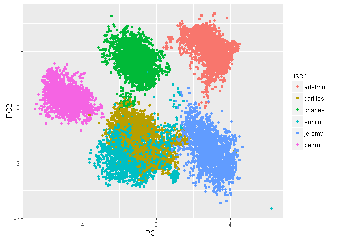
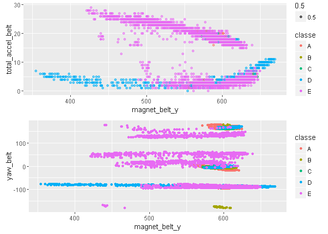

Loading the data
----------------

    df = read.csv("pml-training.csv")

Preprocessing the data
----------------------

    dim(df)

    ## [1] 19622   160

Our dataset has 160 variables. I'm going to reduce dimension of the
data.

In first, I've removed some zero variance predictors

    df <- df[, -nearZeroVar(df)]

It's easy to check dataset has very many NA-values

    sum(sapply(df, function(e) sum(is.na(e))))

    ## [1] 787856

There are variables wich contain more than 80% NA-values

    na80 <- sapply(df, function(e) sum(is.na(e)))/19622>0.8
    names(df)[na80][1:10]

    ##  [1] "max_roll_belt"        "max_picth_belt"       "min_roll_belt"       
    ##  [4] "min_pitch_belt"       "amplitude_roll_belt"  "amplitude_pitch_belt"
    ##  [7] "var_total_accel_belt" "avg_roll_belt"        "stddev_roll_belt"    
    ## [10] "var_roll_belt"

I've removed such predictors

    df <- df[,!na80]

And I'll delete meta-information from list of predictors

    names(df[,1:6])

    ## [1] "X"                    "user_name"            "raw_timestamp_part_1"
    ## [4] "raw_timestamp_part_2" "cvtd_timestamp"       "num_window"

    df <- df[,-c(1:6)]

In the end, I've removed some linear dependencies

    df <- df[, -findCorrelation(cor(df[,-53]), .95)]

So, now I have 49 variables

Next, because test-set "pml-testing.csv" doesn't contain outcome, I'll
create test set from training data

    set.seed(13)
    inTrain <- createDataPartition(y=df$classe, p=0.75, list = F) 
    training <- df[inTrain,]
    testing <- df[-inTrain,]

Principal component analysis
----------------------------

I decided reduce dimension using principal component analysis (PCA). It
wasn't usefull for fitting, but I found something intresting.

    preProc<-preProcess(training, method="pca", thresh = 0.99)
    trainingPC <- predict(preProc, training[,-49]) 
    preProc$numComp

    ## [1] 36

So, we made 36 components wich captured 99% "information"

Now, I'll show what kind of "information"" we captured using principal
components
  
 What does it mean? I think, this picture says us, that in first there
are strong pattern for every users, and in second 2 first prinipal
components (wich you see on pict) contain information about this
pattern. But unfortunally information about users (who made excercises)
is useless for us, because we are going to fit model, wich can work for
everybody. And I supposed that PCA dosn't help me. To check it I fitted
2 decision trees - with source data nd with PCA-preprocessing data.
Results you can see in the table below.

<table>
<thead>
<tr class="header">
<th align="left">Accuracy without PCA</th>
<th align="left">Accuracy with PCA</th>
</tr>
</thead>
<tbody>
<tr class="odd">
<td align="left">0.4985726</td>
<td align="left">0.4051794</td>
</tr>
</tbody>
</table>

Next step I tryed some more popular LM models and compared results
(testing accuracy) (Here I didn't use meta-methods such as boosting,
bagging and so on)

Tree
----

This model I made above, when I was estimating PCA. Accuraccy was not
very high

    varImp(fit_tree)

    ## rpart variable importance
    ## 
    ##   only 20 most important variables shown (out of 48)
    ## 
    ##                   Overall
    ## magnet_belt_y      100.00
    ## total_accel_belt    86.92
    ## yaw_belt            80.82
    ## pitch_forearm       66.24
    ## magnet_dumbbell_z   57.55
    ## roll_forearm        51.68
    ## magnet_arm_x        48.54
    ## magnet_dumbbell_y   42.90
    ## roll_dumbbell       41.07
    ## accel_arm_x         35.74
    ## gyros_belt_z        31.62
    ## magnet_belt_z       28.40
    ## accel_dumbbell_y    19.35
    ## accel_forearm_x     16.11
    ## magnet_forearm_z    12.36
    ## gyros_forearm_x      0.00
    ## pitch_belt           0.00
    ## magnet_forearm_y     0.00
    ## yaw_arm              0.00
    ## gyros_dumbbell_x     0.00

here we see list of the most impotant variables. I would look for some
pattern on scatter-plot with top-variables
  
We can see some pattern on graphs, but in general classes mixed and it's
difficult to obtain high accuracy use simple decision tree. Maybe we can
improve result using boosting?

Linear discriminant analysis
----------------------------

Next I tested LDA, I didn't expect high level of accuracy, but I was
surprised. This model didn't take many time and I use cross-validation.

    fitControl <- trainControl(method = "cv", number = 10, repeats = 10)
    fit_lda <- train(classe~., data=training, method="lda", trControl=fitControl)

    pred_fit_lda <- predict(fit_lda, newdata = testing)
    acc3 <- confusionMatrix(pred_fit_lda, testing$classe)$overall[1]

So, we have quite good level of accuracy - 0.6855628

LDA with bagging
----------------

Next step, I'll try to improve result using bootstrap aggregating
(bagging)

    # lda with bagging 
    bagLDA2 <- train(training[,-49], training$classe, "bag", B = 10, 
                     bagControl = bagControl(fit = ldaBag$fit,
                                             predict = ldaBag$pred,
                                             aggregate = ldaBag$aggregate))
    pred_fit_ldabag <- predict(bagLDA2, newdata = testing)
    acc4 <- confusionMatrix(pred_fit_ldabag, testing$classe)$overall[1]

But bagging couldn't increase accuracy - 0.682708

Blending = tree + LDA
---------------------

Tree and LDA two different classifiers and we can use blending

    predDF<- data.frame(pred_fit_lda, pred1, classe=testing$classe)
    fit_stack <- train(classe~., data=predDF, method="rf")

    pred_fit_stack <- predict(fit_stack, newdata = testing)
    acc6 <- confusionMatrix(pred_fit_stack, testing$classe)$overall[1]

SO: Blending didn't very well increase accuracy - 0.6973899

Random forest
-------------

When we have more than 30 predictors it's reasonably to use random
forest.

    fit_rf3= randomForest(classe~., data=training, mtry=20, ntree=200)
    pred_fit_rf3 <- predict(fit_rf3, newdata = testing)

    acc5 <- confusionMatrix(pred_fit_rf3, testing$classe)$overall[1]

So, we have excelent result: accuracy - 0.9949021

**Resume:**

<table>
<thead>
<tr class="header">
<th align="left">Model</th>
<th align="left">Accuracy</th>
</tr>
</thead>
<tbody>
<tr class="odd">
<td align="left">Tree</td>
<td align="left">0.4985726</td>
</tr>
<tr class="even">
<td align="left">Tree+PCA</td>
<td align="left">0.4051794</td>
</tr>
<tr class="odd">
<td align="left">LDA</td>
<td align="left">0.6855628</td>
</tr>
<tr class="even">
<td align="left">LDA bagging</td>
<td align="left">0.682708</td>
</tr>
<tr class="odd">
<td align="left">Stack LDA+Tree</td>
<td align="left">0.6973899</td>
</tr>
<tr class="even">
<td align="left">Random forest</td>
<td align="left">0.9949021</td>
</tr>
</tbody>
</table>
