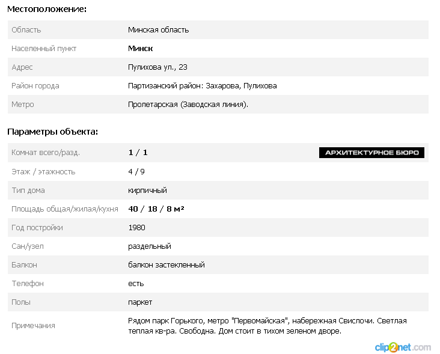
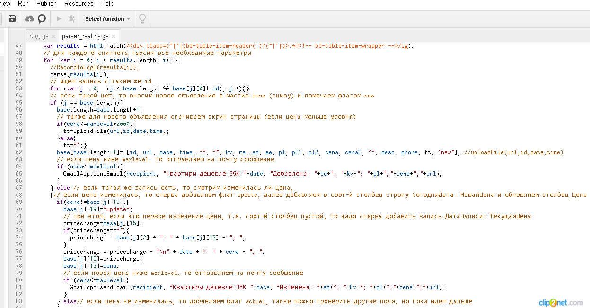
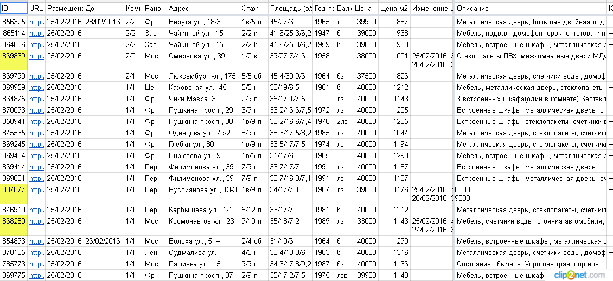

## Step by step

1. I decided to figure out value of flats in Minsk (Belarus)
2. I found the most popular web-site, where salers post offers
3. I coded script, which parses information from the site
4. I preprocessed information 
5. then I made machine learning model
6. finally I deployed my model on shinyapps
```{r}
summary(fit_lda)
```


---


## Source of information

The most popular web-site in Belarus is [realt.by](http://realt.by/sale/flats/search/#tabs)
For example, available information about flat



---

## Programming

Script which parses information was realized using Google Apps Script



---

## Raw data

raw data looks like this


